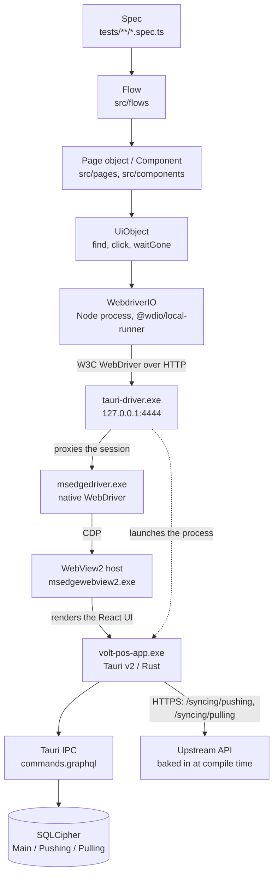

# Architecture

How a line in a spec becomes a click inside a Windows desktop application, and why each layer
between the two exists.

---

## Runtime topology

Six processes are involved in every run. Only the first is yours.



Two edges in that picture are the reason a browser tool cannot be used here.

- **`App --> IPC --> DB`.** The React frontend never issues an HTTP request for its data. Its
  GraphQL fetcher calls the Tauri command `commands.graphql`, which the Rust side answers from the
  local encrypted SQLite database. There is no request to intercept and no response to stub.
- **`TD -.-> App`.** The application is a process, not a page. `tauri-driver` starts it, and the
  window it opens is an OS window with a title bar, a second monitor sibling, a cash drawer and a
  printer behind it.

The dashed launch edge also explains where environment variables must be set. `tauri-driver`
launches the app as a **child process**, so the app inherits the environment of the Node process
that spawned the driver. That is the only injection point available — the WebDriver capability set
has no field for the application's environment — which is why `TauriDriverService` builds the
child's `env` explicitly and forwards anything prefixed `APP_ENV_` (see `appEnvPassthrough()`).

---

## The layers

| Layer                | Lives in                                 | Knows about                                      | Must never                                                           |
| -------------------- | ---------------------------------------- | ------------------------------------------------ | -------------------------------------------------------------------- |
| **Spec**             | `tests/`                                 | Business intent and assertions                   | Contain a selector, or a `browser.*` call other than a window switch |
| **Flow**             | `src/flows/`                             | A sequence of screens, and the guards it needs   | Contain a selector, or assert — flows act, specs assert              |
| **Page / Component** | `src/pages/`, `src/components/`          | One screen or one subtree, and its `Locator`s    | Reach into another page object's selectors                           |
| **UiObject**         | `src/support/UiObject.ts`                | How to resolve a `Locator` and act on the result | Know what a screen is                                                |
| **Driver**           | `configs/wdio/`, `src/support/services/` | Processes, ports, binaries, session lifetime     | Know what a test is                                                  |

The rule that keeps the layering honest: **nothing outside `src/pages` and `src/components` may
call `$()` or `$$()` directly.** ESLint's `wdio` plugin is enabled on `tests/`, `src/pages`,
`src/components` and `src/flows` to catch the classic un-awaited command; the layering rule itself
is enforced in review.

### The two oracle layers

The table above describes how the suite DRIVES the app. Two more layers exist to tell it what the
right answer is, and neither touches the DOM:

| Layer      | Lives in      | Knows about                                 | Must never                                                    |
| ---------- | ------------- | ------------------------------------------- | ------------------------------------------------------------- |
| **API**    | `src/api/`    | The app's GraphQL schema, read-only         | Send a mutation — data this suite creates goes through the UI |
| **Domain** | `src/domain/` | The money model, recomputed from raw inputs | Import the app, or read a figure the app already derived      |

They exist because a spec that reads a total off the screen and compares it to another number on
the same screen proves only that the screen agrees with itself. `src/api` fetches the row the
screen was rendered from — every document there is transcribed from the app's own `.gql.ts`, so a
mismatch is a rendering bug rather than a query difference. `src/domain` goes one further and
recomputes the figure from its parts, which is what catches a rollup that has drifted from the
numbers it summarises.

`src/domain` is pure, so it is the only part of this repo that can be tested without the app:
`npm run test:unit` runs it on `node:test` in about a second. That matters more than it looks — the
model is a port of the backend's `report.rs`, and a transcription slip there would produce an
oracle that confidently agrees with the wrong number.

**Transport note.** `src/api` talks to the schema over the Tauri IPC command `graphql`, not over
HTTP. A packaged build has no HTTP GraphQL endpoint at all: the axum listener is behind the cargo
feature `graphql_server` and `src-tauri/Cargo.toml` declares `default = []`. See
`src/api/transport.ts`.

### Spec

Reads as a description of the business case. It composes a title with `title()` and tags from
`src/types/testTags.ts`, calls flows or page objects, and asserts. A spec that mentions a CSS
selector has skipped a layer.

### Flow

A business action that crosses screens: "create an order for a walk-in customer and pay it in
cash" spans home, checkout, the passcode dialog and the payment-success screen. That sequence is
identical in a dozen specs, so it lives once in `src/flows/`.

Flows are also where `assertWritesAllowed('take a cash payment')` belongs. Putting the guard in the
flow rather than in each spec means a new spec cannot forget it, and the guard names the action in
its error message.

### Page object and component

A **page** owns a route: `name`, `route`, and a `readyAnchor` — the one element that proves the
screen finished rendering. The anchor must be something that only exists once the data arrived (a
table body, a total, the primary action button), never a static header, which paints before the
IPC round trip and lets a spec race ahead of its own data.

A **component** owns a subtree: a dialog, a sheet, a table. Every lookup inside it is scoped under
its `root` element. That is not tidiness. This UI keeps closed Radix dialogs mounted in the DOM and
reuses testids across the order list, the split-order sheet and the receipt preview, so an unscoped
`$()` cheerfully returns the copy inside the hidden dialog. The failure that follows —
"element not interactable" — points nowhere near the cause.

### UiObject

The engine. `find`, `findAll`, `exists`, `isVisible`, `click`, `setValue`, `addValue`, `text`,
`value`, `waitGone`. It resolves a `Locator` into an element, retries the whole candidate chain on
a poll, and produces a failure message that lists every selector it tried and points at
`npm run audit:testids`.

`click()` waits for `waitForClickable` before clicking. On the web that is often redundant; here it
is not. The UI is built for a touch tablet and leans on Radix overlays, so a dialog's fade-in
routinely covers a button that is already visible. Clicking a frame early lands on the overlay, and
the test then fails somewhere unrelated.

### Driver layer

Two WebdriverIO services and four configs. The configs are deliberately thin: everything the
framework _does_ lives in `wdio.shared.conf.ts`, and the per-lane files state only which build they
drive and how strict they are.

---

## Why selectors are `Locator` objects with fallbacks

A selector in this framework is data, not a string inlined into a call:

```ts
const payButton: Locator = locator(
  'pay button',
  'checkout-pay-button',
  '//button[@data-slot="checkout-primary-action"]',
);
```

Three properties: the human `name` used in logs and failure messages, the `testId` the app is
expected to expose, and an ordered list of `fallbacks`. `candidates()` turns that into
`['[data-testid="checkout-pay-button"]', '//button[...]']`, and `UiObject.find` tries them in
order, re-trying the **whole chain** on each poll.

There are four reasons this shape earns its complexity.

**1. The app does not have the testids yet.** The `develop` branch of the app ships 23
`data-testid` attributes. The unmerged `feat/VP-802` branch adds around 157 more. Until that lands,
most screens have to be reached some other way — and the alternative to a declared fallback is an
undeclared one: whatever CSS path happened to work the afternoon the spec was written, buried in a
`$()` call where nobody will ever find it again.

**2. The fallback is reviewed, and it is temporary.** Because the chain is declared, a reviewer can
see it and object to it, and `npm run audit:testids` can enumerate every `testId` the suite depends
on and diff it against the app source. When a testid lands in the app, the audit says so and the
fallback is deleted. Scaffolding with a demolition date, not a strategy.

**3. Retrying the whole chain is what makes a fallback safe.** WebdriverIO's own `waitForExist`
takes one selector. If a locator's chain were tried once, top to bottom, a slow screen would
resolve the fallback while the testid was still unmounted — and on this app the fallback may match
a stale node left behind by the previous route. Polling the entire chain and preferring the
earliest match each round means the testid wins as soon as it exists.

**4. Text is not a selector here.** The app runs i18next and the UI language is merchant state, so
`byExactText('Pay')` silently stops matching the moment someone switches the till to Vietnamese.
Text-based helpers exist in `src/helpers/selectors.ts` for **values** — a price, a customer name, an
order number — and carry that warning in their doc comment. Chrome belongs behind a testid or an
`aria-label`.

---

## Service lifecycle

Both services are registered in `wdio.shared.conf.ts`, and the order is load-bearing:

```ts
services: [[AppLifecycleService, {}], [TauriDriverService, {}]],
```

WebdriverIO runs each hook across services in registration order, so
`AppLifecycleService.beforeSession` completes before `TauriDriverService.beforeSession` starts.

**Why that order matters.** The app registers `tauri-plugin-single-instance`. A stale
`volt-pos-app.exe` left over from a crashed run does not merely waste memory — it **swallows the
next launch**: Windows hands the new invocation to the existing instance, which focuses its own
window and exits the new process. `tauri-driver` then reports a successful launch, opens a session
against a process that is already gone, and every subsequent command times out against a window the
driver has no session with. An orphaned `msedgedriver.exe` is the same problem one layer down: it
still holds port 4444, so the new driver cannot bind it.

`AppLifecycleService.beforeSession` therefore runs first and clears both — `killStaleProcesses`
uses `taskkill /F /T` so the WebView2 host children die with their parent — then optionally resets
the databases and creates the report directories. Only after that is it safe for
`TauriDriverService.beforeSession` to wait for port 4444 to go free, spawn `tauri-driver`, and
block until the port answers.

The full sequence:

| Hook            | `AppLifecycleService`                                                                          | `TauriDriverService`                                                   |
| --------------- | ---------------------------------------------------------------------------------------------- | ---------------------------------------------------------------------- |
| `onPrepare`     | (config) prints the run banner: resolved binary, upstream, merchant, safety flags              | —                                                                      |
| `beforeSession` | kill stale app + drivers, optional DB reset, create `reports/` subdirectories                  | wait for the port to free, spawn `tauri-driver`, wait for it to answer |
| `before`        | Allure labels (`env`, `mode`, `upstream`), install the step overlay, start the updater watcher | —                                                                      |
| `afterTest`     | on failure: screenshot, URL, tail of the app log — all attached to the Allure result           | —                                                                      |
| `after`         | stop the updater watcher; honor `KEEP_APP_OPEN`                                                | —                                                                      |
| `afterSession`  | kill the app process unless `KEEP_APP_OPEN`                                                    | kill the `tauri-driver` child                                          |
| `onComplete`    | (config) prints where the Allure results landed                                                | —                                                                      |

`tauri-driver` is started per **session**, not once per run. It proxies a single WebDriver session
and does not reliably reset between them: a second `newSession` against the same long-lived process
can inherit the previous app's window handles. Restarting it per spec file costs about a second,
which is noise beside the app's own boot, and it removes an entire class of cross-spec
contamination.

---

## One session at a time, permanently

`maxInstances` and `maxInstancesPerCapability` are both `1`, and this is not a tuning knob that
could be relaxed on a bigger machine. Three independent constraints force it:

- `tauri-driver` proxies **one** session.
- The app enforces single-instance, so a second launch is swallowed rather than started.
- Both windows of both "instances" would share the same SQLCipher databases under
  `%APPDATA%\VoltPOS\Databases\<merchantId>`.

A second worker would attach to the first worker's app and corrupt both runs. Parallelism for this
suite means more machines, not more workers.

---

## Two windows, one session

A Volt POS session has two OS windows: `main` (title `VOLT POS`) and `customer`
(title `VOLT POS - Customer Display`, route `/customer`, positioned at x:2560 for the second
monitor). WebDriver sees them as two window handles.

Switching is `browser.getWindowHandles()` → `browser.switchToWindow(handle)` → `browser.getTitle()`
until the title matches. Specs that assert across both carry the `@dual-window` tag, and they are
responsible for switching back to `main` before they finish — the next spec assumes it starts there.

---

## What the framework deliberately does not do

- **It does not read the database.** The three SQLite files are SQLCipher-encrypted; a plain
  `node:sqlite` open of the Main database fails. `src/db/` works at the filesystem level only —
  copy, delete, tail the log. Expected values come from the UI or from the test data, never from a
  decrypted row.
- **It does not stub the backend.** There is no HTTP surface between the frontend and its data, and
  the upstream address is compiled into the binary. A test that needs different data needs
  different data, seeded through the app or the API.
- **It does not use `browser.pause()` as a synchronization primitive** in specs, flows or page
  objects. `UiObject` polls internally on short intervals; everything above it waits on state.
